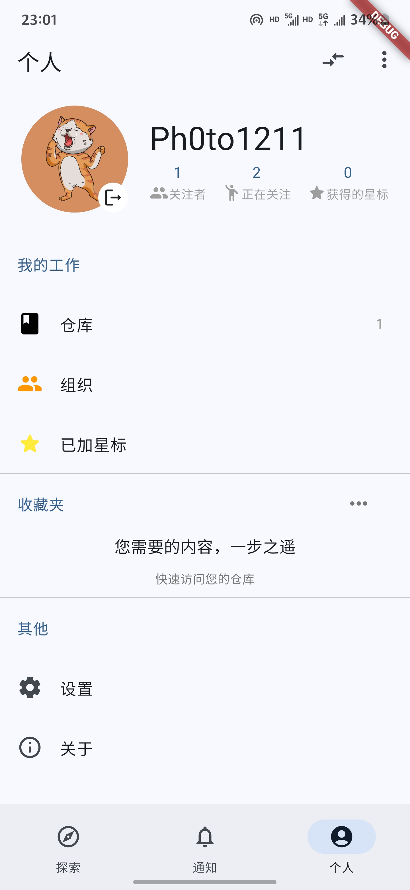

# GitVoar

GitVoar 是使用Flutter开发的第三方github，基于Github API，旨在新手学习flutter，还在不断开发中，欢迎star。

GitVoar is a third-party GitHub project developed with Flutter, aimed at helping beginners learn and explore mobile development. It is still under active development, and stars are welcome.

## 截图 Screenshot

<table>
  <tr>
    <td></td>
    <td></td>
    <td></td>
  <tr>
  <tr>
    <td></td>
    <td></td>
    <td></td>
  <tr>
</table>

## 开发计划 development plan

- [x] 登录功能
  - [x] token登录（）
  - [x] oauth登录
- [x] 搜索功能
  - [x] 搜索仓库
  - [x] 搜索用户
  - [ ] 搜索历史
  - [ ] 筛选
- [x] 仓库相关
  - [x] 添加star
  - [x] 查看star的用户
  - [x] 查看复刻的仓库
  - [x] 查看仓库文件
  - [x] 查看代码
  - [x] 查看commit
  - [x] 查看release
  - [ ] 查看issue
  - [ ] 查看图片
  - [ ] 切换branch
  - [ ] ...
- [x] 用户相关
  - [x] 查看用户的仓库
  - [x] 查看用户的组织
  - [x] 查看用户的star
  - [ ] 关注用户
  - [ ] ...
- [x] 发现相关
  - [x] 热门仓库
  - [ ] 推荐仓库
  - [ ] 仓库动态
- [x] 通知功能
  - [ ] ...
- [x] 设置相关
  - [ ] 适配深色模式
  - [ ] 主题颜色选择
  - [ ] ...

## 鸣谢

- [《Flutter实战·第二版》](https://book.flutterchina.club/)
- [GitHub REST API](https://docs.github.com/en/rest?apiVersion=2022-11-28)
- [pilipala](https://github.com/guozhigq/pilipala)
- [dio](https://pub.dev/packages/dio)

## 免责声明

本项目基于 GNU 通用公共许可证第3版（GPL-3.0）授权。我们不对其适用性、可靠性或准确性作出任何明示或暗示的保证。在法律允许的最大范围内, 作者和贡献者不承担任何因使用本软件而产生的直接、间接、偶然、特殊或后果性的损害赔偿责任。

使用本项目需遵守所在地法律法规, 不得进行任何侵犯第三方知识产权的行为。因使用本项目而产生的数据和缓存应在24小时内清除, 超出24小时的使用需获得相关权利人的授权。

## 禁止商用条款

本软件仅供个人学习、研究或非商业用途。禁止将本软件用于任何商业目的, 包括但不限于出售、出租、许可或以其他形式从中获利。
